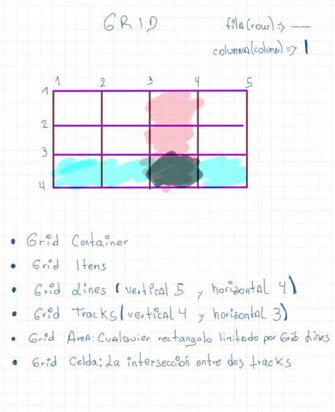

#Recursos

1. Grid: Es un layout creado por microsoft, puede ser complementario a flex.
2. Grid container: El contenedor principal padre.
3. Grid items: Hijos directos del grid container.
4. Grid lines: Son todas las líneas horizontales y verticales.
5. Grid tracks: Son todas las filas o comlumnas que hay uen la tabla.
6. Grid area: Es cualquier rectángulo limitado por grid lines.
7. Grid cell: Es la intersección entre dos tracks.

